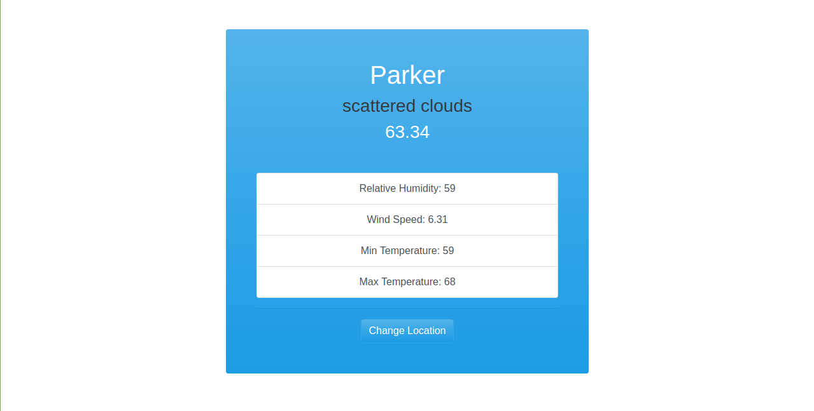
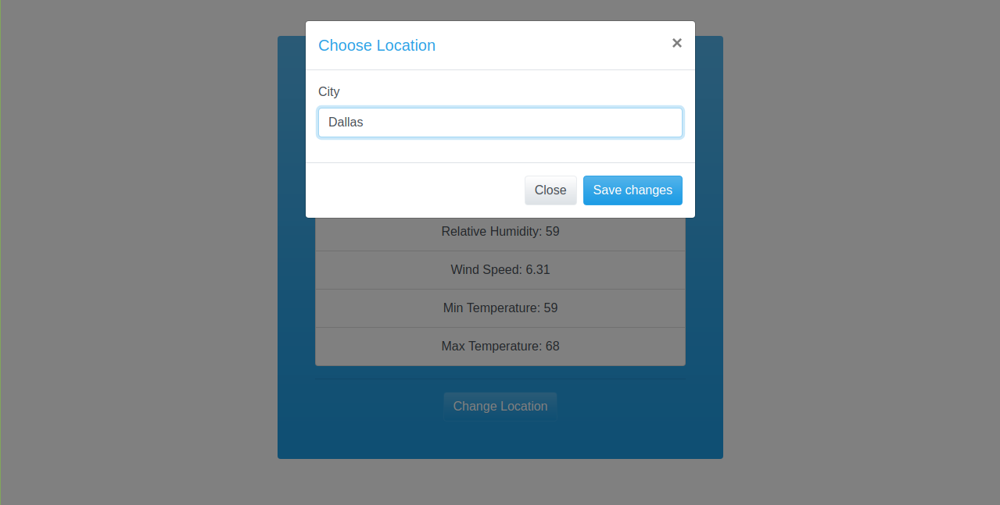
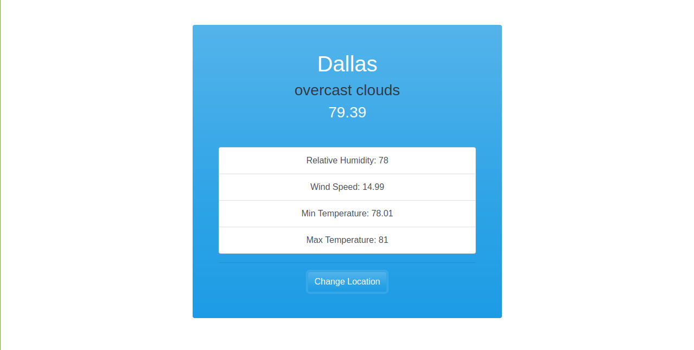

<h1 align="center">WeatherJS App</h1>

A web application that displays weather information for a city

## Table of Contents
* [Project Status](#project-status)
* [Features](#features)
* [Screenshots](#screenshots)
* [Technologies](#technologies)
* [Inspirations](#inspirations)
* [Contact](#contact)
* [License](#license)

## Project Status
This project is currently: _In Progress_

## Features
Complete:
- [X] Display weather information for a city
- [X] User can change the city
- [X] City persists in localStorage

To-Do List:
- [] Utilize better weather api that allows user to specify state, country, etc
- [] Refactor display to include relative humidity, dewpoint, feels like, and wind
- [] Allow users to 'save' cities and display brief weather information next to main display
- [] User can click on the 'saved' cities and view more detail
- [] User can delete cities from their 'saved' list

## Screenshots

## Technologies
Built with:
* HTML
* CSS
* JavaScript / jQuery
* OpenWeatherMap API

## Inspirations
This project was built as part of Brad Traversy's Udemy course, [Modern JavaScript from the Beginning](https://www.udemy.com/modern-javascript-from-the-beginning/).

## Contact
Twitter - [@CBStanley12](https://twitter.com/CBStanley12)

DEV - [cbstanley12](https://dev.to/cbstanley12)

Personal Website - [cbstanley.tech](https://cbstanley.tech)

## License
**MIT License**: 
A short and simple permissive license with conditions only requiring preservation of copyright and license notices. Licensed works, modifications, and larger works may be distributed under different terms and without source code.